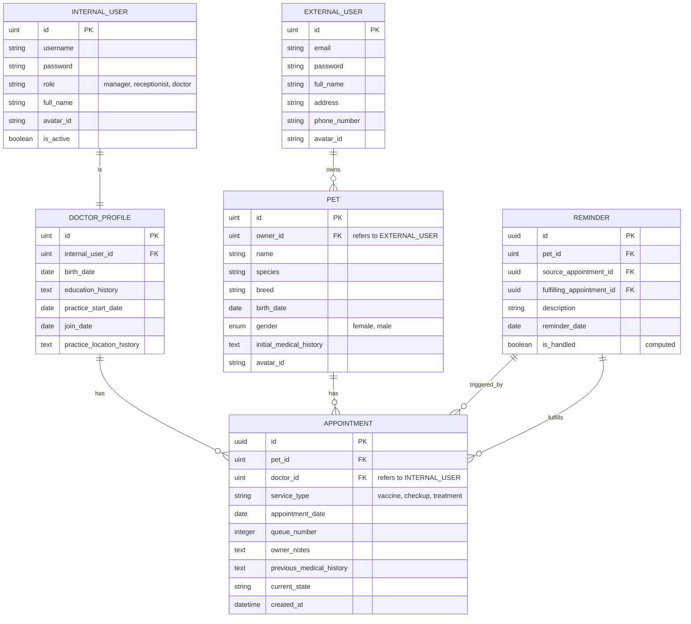

# Skema Basis Data Klinik Hewan

## MySQL

> [!IMPORTANT]
> **TODO:** Migrasikan tabel `EXTERNAL_USER`, `INTERNAL_USER`, `DOCTOR_PROFILE`, dan `PET` untuk menggunakan **UUID** sebagai Primary Key (saat ini masih menggunakan `uint`). Tabel `APPOINTMENT` dan `REMINDER` sudah menggunakan UUID.

Berikut adalah rancangan tabel basis data berdasarkan spesifikasi sistem.



1. **EXTERNAL_USER**: Menyimpan data login dan profil untuk Pemilik Hewan pada aplikasi eksternal.
2. **INTERNAL_USER**: Menyimpan data login, peran staf klinik (Manajer, Resepsionis, Dokter), dan referensi avatar pada aplikasi internal.
3. **DOCTOR_PROFILE**: Data tambahan khusus untuk dokter yang terhubung ke akun staf internal. (Catatan: Field `special_services_history` telah dihapus).
4. **PET**: Data hewan peliharaan yang terhubung ke Pemilik Hewan (EXTERNAL_USER). Menyimpan informasi medis dasar dan referensi avatar.
5. **APPOINTMENT**: Inti dari sistem antrian. Menyimpan jenis layanan, nomor antrian, dan status saat ini. Data riwayat status dan rekam medis disimpan di MongoDB.
6. **REMINDER**: Pengingat medis yang dibuat oleh dokter. Dapat melacak keterkaitan dengan janji temu asal dan janji temu baru yang menanganinya.

## MongoDB

### 1. appointment_reservations
Menyimpan data awal yang diinputkan oleh pemilik hewan saat melakukan reservasi. Data ini akan menjadi acuan awal bagi dokter sebelum mengisi rekam medis lengkap.

```json
{
  "_id": "ObjectId",
  "appointment_id": "UUID",
  "service_type": "string (vaccine | checkup | treatment)",
  "details": {
    // Jika service_type == checkup
    "purpose": "string",
    "focus_area": "string",

    // Jika service_type == treatment
    "observed_symptoms": ["string"],
    "symptom_duration": "string",
    "home_care_received": "boolean",

    // Jika service_type == vaccine
    "vaccine_type": "string"
  },
  "created_at": "datetime"
}
```

### 2. medical_records
Menyimpan data medis lengkap untuk setiap janji temu. Menggunakan pola satu dokumen per rekam medis dengan sub-dokumen untuk data spesifik layanan.

```json
{
  "_id": "ObjectId",
  "appointment_id": "UUID",
  "physical_examination": {
    "weight": "float",
    "temperature": "float",
    "physical_condition": "string",
    "heart_rate": "string",
    "respiratory_rate": "string"
  },
  "service_data": {
    "type": "string (vaccine | checkup | treatment)",
    "details": {
      // Jika type == vaccine
      "vaccine_type": "string",
      "brand": "string",
      "batch_number": "string",
      "administration_date": "date",
      "pre_vaccine_condition": "text",
      "post_vaccine_reaction": "text",
      
      // Jika type == checkup
      "palpation": "text",
      "cleanliness_notes": "text",
      "nutrition_recommendations": "text",
      "periodic_care_recommendations": "text",

      // Jika type == treatment
      "clinical_symptoms": "text",
      "diagnosis": "text",
      "medical_actions": "text",
      "prescription": "text",
      "home_care_notes": "text",
      "estimated_cost": "decimal"
    }
  },
  "created_at": "datetime"
}
```

### 2. status_histories
Audit log untuk melacak perubahan status pada janji temu.

```json
{
  "_id": "ObjectId",
  "appointment_id": "UUID",
  "state": "string",
  "actor_id": "UUID",
  "actor_role": "string",
  "changed_at": "datetime",
  "reason": "string (optional, mandatory for rejection)"
}
```

### 3. login_logs
Mencatat riwayat login pengguna untuk tujuan keamanan dan audit.

```json
{
  "_id": "ObjectId",
  "user_id": "UUID",
  "user_type": "string (internal | external)",
  "ip_address": "string",
  "user_agent": "string",
  "login_at": "datetime"
}
```

### 4. otp_logins (Opsional)
Penyimpanan sementara untuk kode OTP dengan mekanisme kedaluwarsa otomatis.

```json
{
  "_id": "ObjectId",
  "user_id": "UUID",
  "user_type": "string (internal | external)",
  "otp_code": "string",
  "expires_at": "datetime (index TTL)"
}
```

### 5. fcm_tokens
Menyimpan token Firebase Cloud Messaging untuk notifikasi push.

```json
{
  "_id": "ObjectId",
  "user_id": "UUID",
  "user_type": "string (internal | external)",
  "token": "string",
  "device_type": "string",
  "created_at": "datetime",
  "last_used_at": "datetime"
}
```

### 6. refresh_tokens
Menyimpan refresh token untuk manajemen sesi yang aman. TTL diatur pada `ttl_expiry` yang nilainya lebih lama dari `expires_at` (misal: +7 hari) untuk memungkinkan audit dan fitur "logout all devices" bahkan setelah token tidak lagi berlaku secara fungsional.

```json
{
  "_id": "ObjectId",
  "user_id": "UUID",
  "user_type": "string (internal | external)",
  "token": "string",
  "expires_at": "datetime",
  "ttl_expiry": "datetime (index TTL, set to expires_at + 7 days)",
  "created_at": "datetime",
  "is_revoked": "boolean"
}
```
