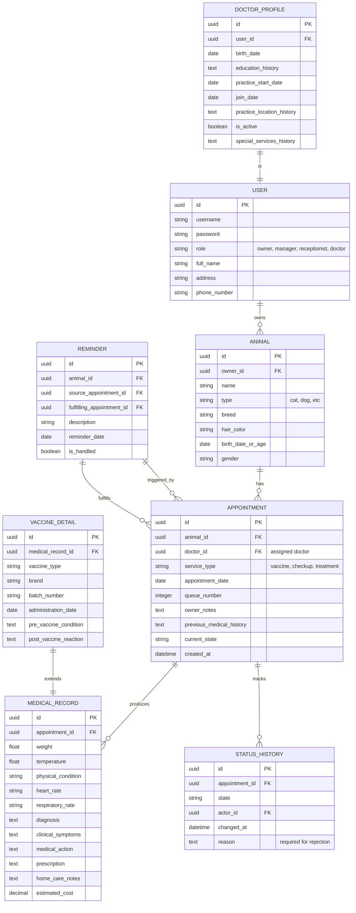

# Skema Basis Data Klinik Hewan

Berikut adalah rancangan tabel basis data berdasarkan spesifikasi sistem.

## Penjelasan Tabel

1. **USER**: Menyimpan data login dan profil dasar untuk semua peran (Pemilik, Manajer, Resepsionis, Dokter).
2. **DOCTOR_PROFILE**: Data tambahan khusus untuk peran Dokter, termasuk riwayat pendidikan dan status aktif.
3. **ANIMAL**: Data hewan peliharaan yang terhubung ke Pemilik (USER).
4. **APPOINTMENT**: Inti dari sistem antrian. Menyimpan jenis layanan, nomor antrian, dan status saat ini.
5. **STATUS_HISTORY**: Audit log untuk mencatat setiap perubahan status (state) layanan, aktor yang mengubah, dan alasan (jika ditolak).
6. **MEDICAL_RECORD**: Data pemeriksaan fisik umum dan hasil medis yang diisi oleh Dokter.
7. **VACCINE_DETAIL**: Tabel tambahan khusus untuk menyimpan detail teknis vaksinasi (merk, batch, dll).
8. **REMINDER**: Pengingat medis yang dibuat oleh dokter. Dapat melacak apakah pengingat sudah ditangani melalui janji temu baru.
